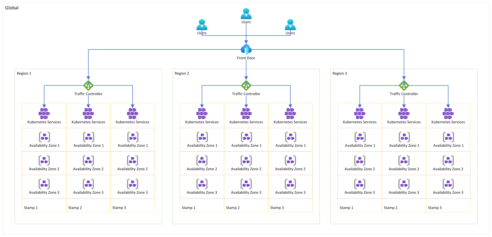

# 🌐 Traffic Routing

This repository provides insights into implementing Deployment Stamp patterns in Microsoft Azure through Bicep, following best practices for ensuring application resilience and high availability.

By leveraging Azure resources such as Front Door, Application Gateway for Containers, Kubernetes Service, and Availability Zones, the repository demonstrates the construction of a resilient architecture. It places particular emphasis on establishing a dependable infrastructure for distributing traffic across global clusters. This is achieved through the integration of both global and regional networking components. The end result is a highly available and scalable framework designed to optimize traffic routing and enhance overall performance.



---

## Repository Structure

Within the `src/` directory, you'll find the following artifacts:

- `main.bicep`: This Bicep file loads defaults, user-defined settings, and resource modules.
- `main.bicepparam`: Bicep parameter file handling environment-specific settings.
- `bicepconfig.json`: JSON file customizing the Bicep development experience.
- `defaults.json`: JSON file providing Bicep with a set of reusable common values.
- `modules/`: Contains resource groups and resource modules to quickly get started.

The global files handle the deployment of Azure Front Door and configure traffic routing policies.

- `modules/global.scope.bicep`: Handles the global deployment at the subscription scope, such as Resource Group creation and Role Assignments.
- `modules/global.resources.bicep`: Handles the creation of Azure Resources, such as Front Door.

The region files deploy Application Gateways for Containers as a regional service, distributing traffic across stamps.

- `modules/region.scope.bicep`: Handles the global deployment at the subscription scope, such as Resource Group creation and Role Assignments.
- `modules/region.resources.bicep`: Handles the creation of Azure Resources, such as Application Gateway for Containers.

The stamp files deploy Kubernetes clusters along with Virtual Networks and Managed Identity. Stamps are isolated compute units without east-west connectivity options.

- `modules/stamp.scope.bicep`: Handles the global deployment at the Resource Group scope.
- `modules/stamp.resources.bicep`: Handles the creation of Azure Resources, such as Kubernetes.

The application files configure the Kubernetes control plane, deploying the controller for Application Gateway for Containers, along with a sample application on the cluster.

- `modules/cluster.application.bicep`: Handles the creation of an example Kubernetes application deployment.
- `modules/cluster.controller.bicep`: Handles the creation of the Application Gateway for Containers on Kubernetes controller.
- `modules/cluster.gateway.bicep`: Handles the creation of the Gateway API resources for Application Gateway for Containers.

Within the `eng/` directory, find the following artifacts:

- `images/`: Contains images for the README.md file.
- `scripts/`: Contains deployment stack creation and deletion scripts.

---

## Getting Started

Initiate authentication into the Azure CLI and then choose the preferred subscription.

```bash
az login
az account -s '{Subscription}'
```

Execute the provided Shell Script to generate a Deployment Stack and create the Azure resources outlined in this repository.

```bash
./eng/scripts/create.sh
```

Execute the given Shell Script to remove the Azure resources deployed through this repository; this will delete the Deployment Stack along with its associated resources.

```bash
./eng/scripts/delete.sh
```

## Notice

> Please note that while the Application Gateway for Containers service is in preview, there is a limitation allowing only one association per AGfC resource. This restriction currently prevents the use of more than one stamp per region. I'll update this repository once this limitation has been lifted. For additional details, please refer to [Microsoft Learn](https://learn.microsoft.com/azure/application-gateway/for-containers/application-gateway-for-containers-components). The source code for the restriction can be found [here](./src/modules/region.resources.bicep#L48).
